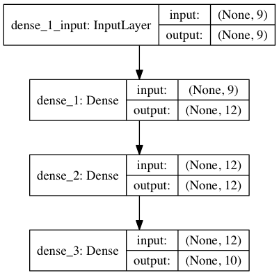

# WeightliftingApp ML Model
A series of programs written in Python using [Weightling App](https://github.com/ChappyA12/BenchTracker_iOS) data to train a [Keras](https://keras.io) deep learning model for the purpose of workout type prediction based on the exercises performed.

### Body split training _input_ example:

``` "2 Abs / Core#3 Biceps#2 Triceps" ``` becomes ``` [ 2 0 3 0 0 0 0 0 2 ] ``` :

| Abs / Core | back | Biceps | cardio | chest | legs | Olympic | shoulders | Triceps |
| :---: | :---: | :---: | :---: | :---: | :---: | :---: | :---: | :---: |
| 2 | 0 | 3 | 0 | 0 | 0 | 0 | 0 | 2 |

### Categorical _expected_ output example:

``` "arms" ``` becomes ``` [ 0 1 0 0 0 0 0 0 0 0 0 0 ] ``` :

| abs | arms | back | cardio | chest | legs | shoulders | push | pull | chestBack | chestBiceps | fullBody |
| :---: | :---: | :---: | :---: | :---: | :---: | :---: | :---: | :---: | :---: | :---: | :---: |
| 0 | 1 | 0 | 0 | 0 | 0 | 0 | 0 | 0 | 0 | 0 | 0 |
<pre>
      ||||||||
      ||||||||
      ||||||||
  Processed by model
    \\\\\\//////
      \\\\////
        \\//
</pre>
### Categorical _actual_ output example:

``` [ .003 .981 .001 .002 .000 .000 .000 .000 .000 .000 .012 .001 ] ``` becomes ``` "arms" ``` :

| abs | arms | back | cardio | chest | legs | shoulders | push | pull | chestBack | chestBiceps | fullBody |
| :---: | :---: | :---: | :---: | :---: | :---: | :---: | :---: | :---: | :---: | :---: | :---: |
| .003 | .981 | .001 | .002 | .000 | .000 | .000 | .000 | .000 | .000 | .012 | .001 |

### Current accuracy (744 training points @ 100,000 epochs, categorical crossentropy):
 - Training data: 100.0% :thumbsup:
 - Test data: 97.0% :thumbsup:

### Current model

