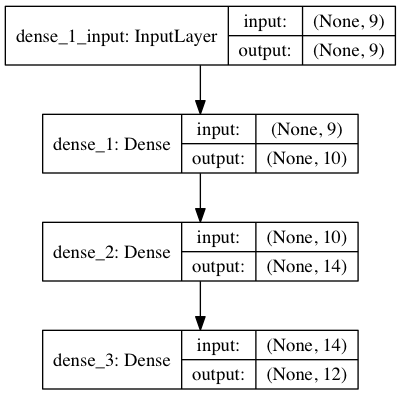

# WeightliftingApp ML Model
A series of programs written in Python using [Weightling App](https://github.com/ChappyA12/BenchTracker_iOS) data to train a [Keras](https://keras.io) deep learning model for the purpose of workout type prediction based on the exercises performed.

### Body split training _input_ example:

``` "2 Abs / Core#3 Biceps#2 Triceps" ``` becomes ``` [ 2 0 3 0 0 0 0 2 ] ``` :

| Abs / Core | Back | Biceps | Chest | Legs | Olympic | Shoulders | Triceps |
| :---: | :---: | :---: | :---: | :---: | :---: | :---: | :---: |
| 2 | 0 | 3 | 0 | 0 | 0 | 0 | 2 |

### Categorical _expected_ output example:

``` "Arms" ``` becomes ``` [ 1 0 0 0 0 0 0 0 0 0 ] ``` :

| Arms | Chest and Tri | Chest | Chest and Back | Back and Bi | Back | Shoulders | Legs | Other | Full Body |
| :---: | :---: | :---: | :---: | :---: | :---: | :---: | :---: | :---: | :---: |
| 1 | 0 | 0 | 0 | 0 | 0 | 0 | 0 | 0 | 0 |
<pre>
      ||||||||
      ||||||||
      ||||||||
  Processed by model
    \\\\\\//////
      \\\\////
        \\//
</pre>
### Categorical _actual_ output example:

``` [ .931 .004 .001 .003 .000 .000 .000 .000 .022 .004 ] ``` becomes ``` "Arms" ``` :

| Arms | Chest and Tri | Chest | Chest and Back | Back and Bi | Back | Shoulders | Legs | Other | Full Body |
| :---: | :---: | :---: | :---: | :---: | :---: | :---: | :---: | :---: | :---: |
| .931 | .004 | .001 | .003 | .000 | .000 | .000 | .000 | .022 | .004 |

### Current accuracy (~250 training data points):
 - Training data: 98.2%
 - Test data: 82.8%
     
### Current model

